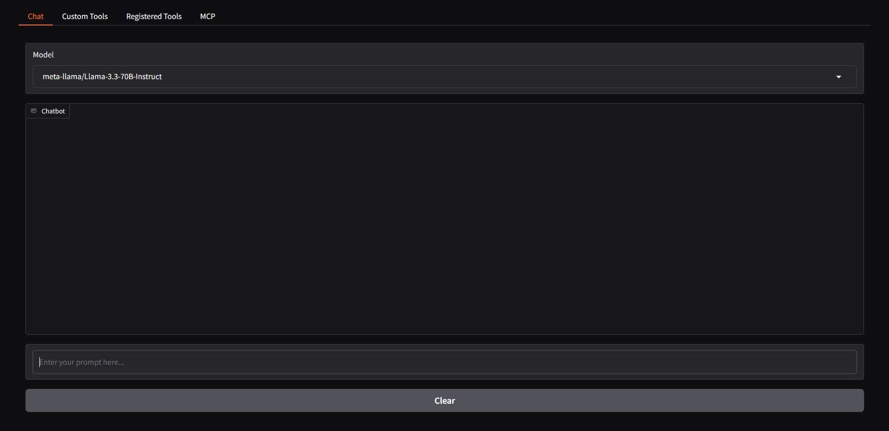

# Installation and Setup Guide

This document provides step-by-step instructions for setting up the development environment and running the application.

## Screenshot



## Prerequisites

Before starting, ensure that you have all the necessary tools installed on your system.

## Installation Steps

### 1. Installing and Running Ollama (skip if you will use Together.ai API)

Ollama is required to provide model inference capabilities.

1. Download and install Ollama from [https://ollama.com/](https://ollama.com/)
2. Start the Ollama service with the command:
   ```bash
   ollama serve
   ```
   ```bash
   ollama pull llama3.2:3b
   ```
   

### 2. Setting Up LLama-Stack

LLama-Stack will be used to manage our inference environment.

1. Install the `uv` package manager
2. Set up a virtual environment (venv)
3. Run the following command inside the virtual environment:
   ```bash
   INFERENCE_MODEL=llama3.2:3b llama stack build --template ollama --image-type venv --run
   ```
   or
   ```bash
   INFERENCE_MODEL=meta-llama/Llama-3.3-70B-Instruct llama stack build --template together --image-type venv --run
   ```

### 3. Project Setup

Clone this repository and install the necessary dependencies:

1. Clone the repository:
   ```bash
   git clone [https://github.com/ricardoborges/chatlab.git]
   cd [chatlab]
   ```

2. Create a virtual environment and install dependencies:
   ```bash
   uv venv
   uv pip install -r myproject.toml
   ```

### 4. Running the Application

Create togetherAI account if you won't start Ollama local service. So, you would first get an API key from Together if you dont have one already.

How to get your API key: 
https://docs.google.com/document/d/1Vg998IjRW_uujAPnHdQ9jQWvtmkZFt74FldW2MblxPY/edit?tab=t.0

You will need this env variables in your .env file:

TAVILY_SEARCH_API_KEY=
TOGETHER_API_KEY=

Or just ignore and set DEFAULT_STACK="Ollama" in main.py (if you will run local Ollama service)

Start the Gradio application with the following command:

```bash
gradio main.py
```

After running this command, the application interface will be available in your browser.

## Troubleshooting

If you encounter any issues during installation, check:
- That the Ollama service is running
- That the virtual environment was activated correctly
- That all dependencies were successfully installed

## Additional Resources

For more information about LLama-Stack, refer to the [official documentation](https://llama-stack.readthedocs.io/en/latest/getting_started/index.html).